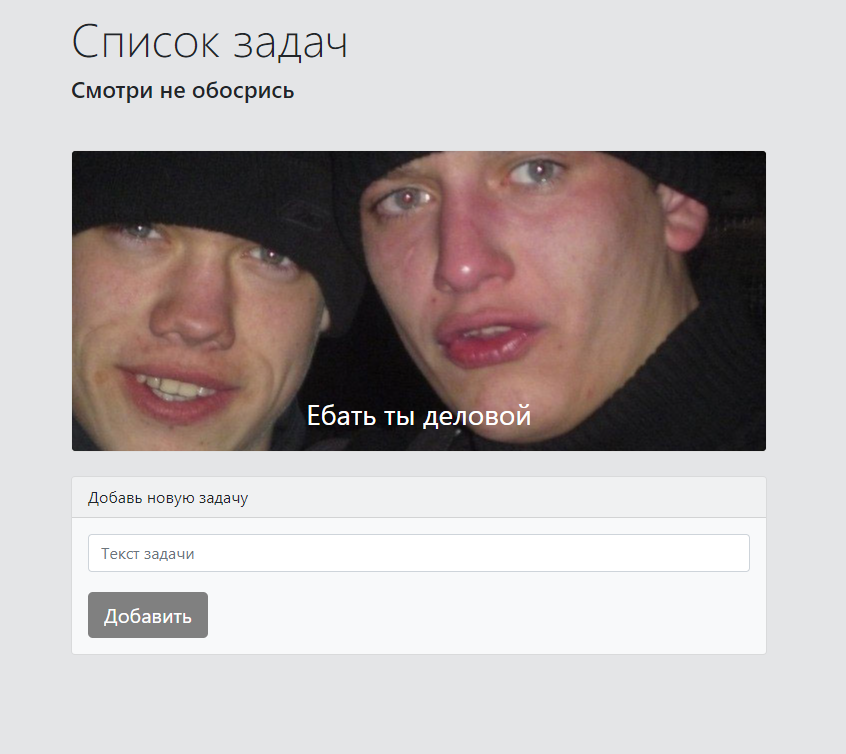

# Приложение ToDo с подьебками

Приложение сделано на HTML (Bootstrap), CSS, JS. С помощью localStorage способно запоминать актуальный список задач и их состояние. Приложение выводит на экран popup c рандомной картинкой (fetch запрос) после каждой новой задачи кратной 3.
## Screenshots

## 🚀 Контакты

Telegram: https://t.me/alekshelis

Email: alekshelis@yandex.ru